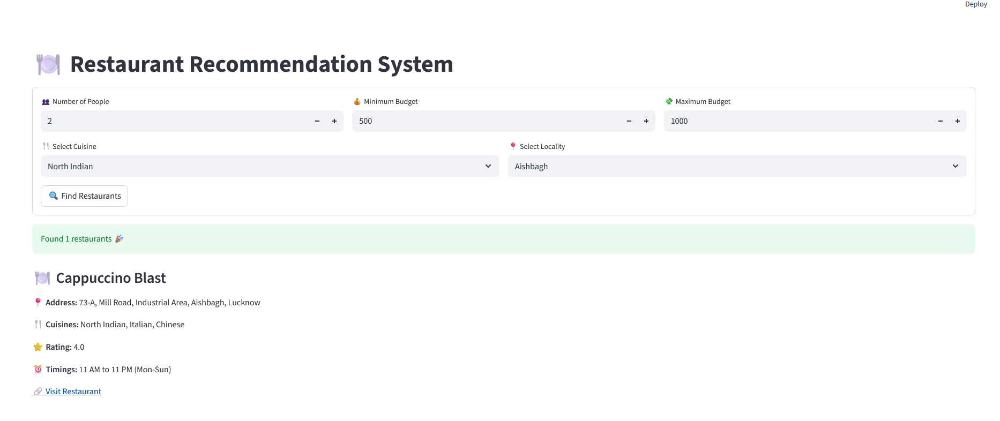
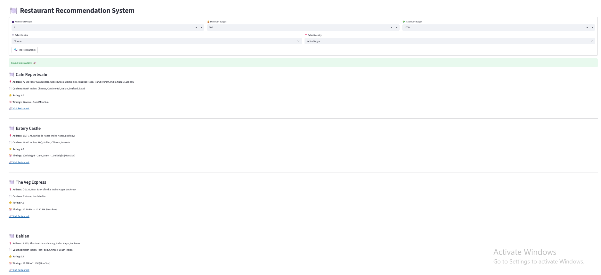

# Restaurant-Recommendation-System
A machine learning–powered restaurant recommendation system built with FastAPI (backend) and Streamlit (frontend).
The system recommends restaurants based on budget, number of people, cuisine preference, and locality.

---

## 🚀 Features

- 🔍 Personalized restaurant recommendations
- 🤖 Content-based filtering using Cosine Similarity
- ⚡ FastAPI backend with REST API
- 🎨 Streamlit interactive frontend
- 📊 Real-world CSV dataset
- 🧠 Scikit-learn powered ML logic
- 📍 Location & cuisine-based filtering

---

## 🛠️ Tech Stack

- Python
- FastAPI – Backend API
- Streamlit – Frontend UI
- Pandas & NumPy – Data processing
- Scikit-learn – ML & similarity computation
- Uvicorn – ASGI server

---

## 📂 Project Structure
```bash
Restaurant-Recommendation-System/
│
├── app1.py                # FastAPI backend
├── streamlit_app.py       # Streamlit frontend
├── food1.csv              # Dataset
├── environment.yml        # Conda environment file
├── README.md
```

---

## 🧪 Machine Learning Approach

- Uses CountVectorizer on restaurant highlights
- Computes Cosine Similarity
- Recommends top similar restaurants
- Filters based on:
  - Budget per person
  - Cuisine
  - Locality

 ---

## ⚙️ Installation & Setup
Clone the repository
```bash
git clone https://github.com/Chintan1545/restaurant-recommendation-system.git
cd restaurant-recommendation-system
```

---

 ## 🐍 Conda Environment Setup

 1️⃣ Create Conda Environment
 ```bash
conda create -n restaurant-rec python=3.10 -y
```
2️⃣ Activate Environment
```bash
conda activate restaurant-rec
```
3️⃣ Install Dependencies
```bash
pip install fastapi uvicorn streamlit pandas numpy scikit-learn requests
```

---

## ▶️ How to Run the Project

🔹 Start FastAPI Backend
```bash
uvicorn app1:app --reload
```
Backend runs at:
```bash
http://127.0.0.1:8000
```
Swagger Docs:
```bash
http://127.0.0.1:8000/docs
```

---

## 🔹 Start Streamlit Frontend 

Open a new terminal:
```bash
streamlit run streamlit_app.py
```
Frontend runs at:
```bash
http://localhost:8501
```

---

## 📌 API Endpoint
```bash
POST /search
```
Request Body 
```bash
{
  "people": 2,
  "min_price": 200,
  "max_price": 1000,
  "cuisine": "North Indian",
  "locality": "Alambagh"
}
```
Response
```bash
{
  "restaurants": [
    {
      "name": "Restaurant Name",
      "address": "Address",
      "locality": "Area",
      "cuisines": "North Indian",
      "aggregate_rating": "4.2",
      "timings": "10 AM - 11 PM",
      "url": "https://example.com"
    }
  ]
}
```

---


## 📸 Screenshots

### 🔹 Home Page


### 🔹 Recommendation Results


---


## 📈 Future Improvements

🔹 Multi-select cuisine
🔹 User login system
🔹 Cloud deployment
🔹 Model optimization
🔹 Mobile-friendly UI

---

## 👨‍💻 Author

Chintan Dabhi
